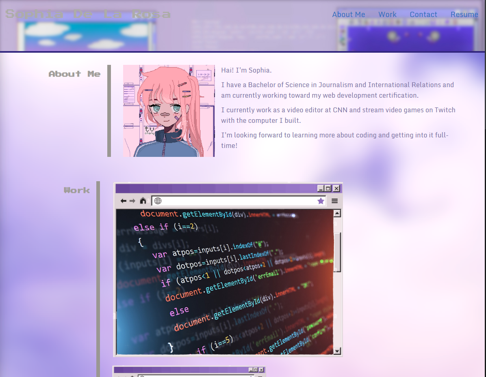

# 02 Advanced CSS: Professional Portfolio Challenge Week 2

## by Sophia De La Rosa

**User story:** "As an employer, I want to view a potential employee's deployed portfolio of work samples to that I can review samples of their work and assess whether they're a good candidate for an open position."

Description of product: Portfolio site designed to display work related to web development, including an About Me section, contact information and a resume. Comments added for clarity. Future updates will include:
    *Navbar links designed as desktop folder icons
    *Better grid division
    *Real work examples with titles and descriptions
    *Contact info listed in a more efficient way
    *Link to download resume as a PDF.
    *Other sections for other interests, like pc building and gaming

Link to deployed application: https://sophiadelarosa.github.io/challenge02/

## Mock-Up 

The following image shows the web application's appearance and functionality: 

